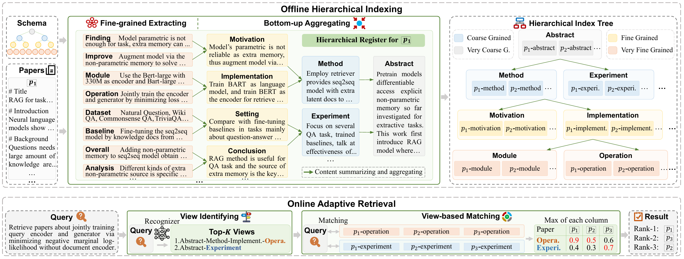

# PaperRegister

PaperRegister: Boosting Flexible-grained Paper Search via Hierarchical Register Indexing (*The code is currently being organized, and the final version of the code is planned to be completed after the paper is officially published*)




### Offline Hierarchical Indexing

``` bash
# fine-grained extracting
bash regist_step1_extract.sh

# bottom-up aggregrating
bash regist_step2_transform.sh

# get the hierarchical index tree
python offline.py

```

### Online Adaptive Retrieval

``` bash
# view identifying
python plus_router_get_tree.py
bash plus_router_inference.sh

# view-based matching
python plus_online.py

# get result
python plus_get_score.py
```

### View Recognizer Training
``` bash
# sft
bash plus_router_train_sft.sh

# hierarchical-reward grpo
bash plus_router_train_grpo.sh
```
